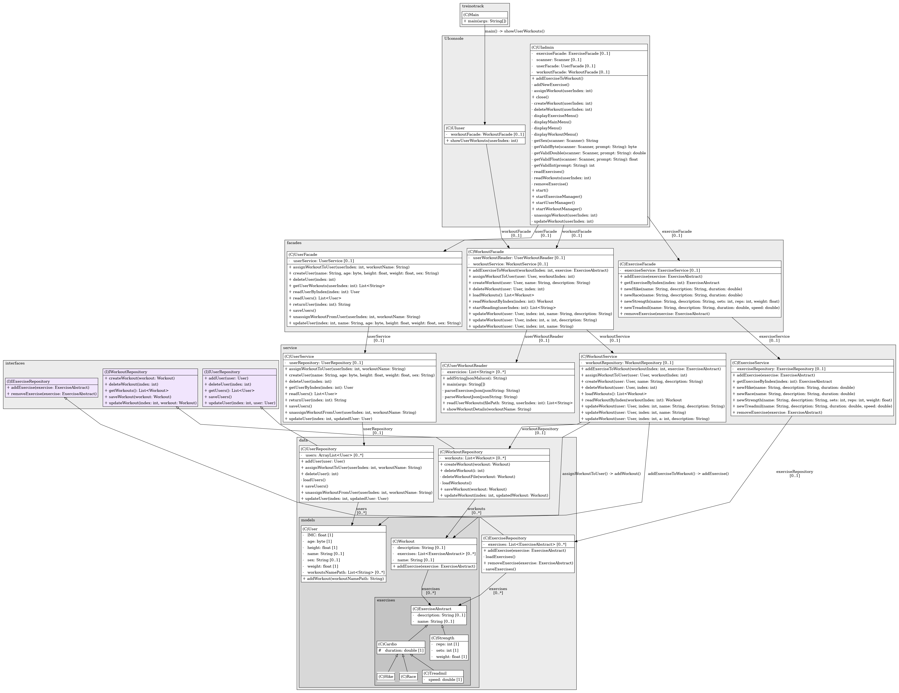

# Treino Track

Treino Track é uma API RESTful desenvolvida em **Python** com **FastAPI** e **SQLAlchemy** para gerenciamento de treinos, exercícios, avaliações físicas, metas, equipamentos e usuários em academias ou ambientes fitness.

## Funcionalidades

- **Gestão de Usuários**: Cadastro, consulta e associação de usuários a treinos.
- **Metas**: Criação, consulta, atualização e remoção de metas individuais.
- **Avaliações Físicas**: Registro e consulta de avaliações físicas de alunos.
- **Equipamentos**: Cadastro, edição e consulta de equipamentos.
- **Exercícios**: CRUD completo para exercícios, incluindo nível de dificuldade e associação a equipamentos.
- **Músculos**: Cadastro e gerenciamento de grupos musculares.
- **Treinos**: CRUD de treinos, com associação a usuários e exercícios.
- **Registro de Treinos**: Registro de execuções de treinos, calorias queimadas e feedback.
- **Associação Usuário-Treino**: Controle de quais treinos pertencem a quais usuários.
- **Associação Treino-Exercício**: Organização dos exercícios dentro de cada treino, com ordem, séries e repetições.

## Estrutura do Projeto

O projeto está organizado da seguinte forma:

- `app/main.py`: Ponto de entrada da aplicação FastAPI.
- `app/models/`: Modelos SQLAlchemy das entidades do sistema.
- `app/schemas/`: Schemas Pydantic para validação e serialização.
- `app/routers/`: Rotas FastAPI para cada recurso (usuário, treino, exercício, etc).
- `app/database.py`: Configuração do banco de dados.
- `requirements.txt`: Dependências do projeto.

## Como Executar

### Pré-requisitos

- Python 3.9+
- MySQL ou outro banco compatível com SQLAlchemy
- (Opcional) Docker

### Executando com Docker

O projeto já possui um `docker-compose.yml` configurado para subir tanto o banco de dados (MariaDB) quanto a API Python.

#### Passos

1. **Clone o repositório e acesse a pasta do projeto:**
    ```sh
    git clone https://github.com/Nertonm/treino-track.git
    cd treino-track
    ```

2. **(Opcional) Ajuste variáveis de ambiente**  
   Se necessário, edite o `docker-compose.yml` para alterar usuário, senha ou nome do banco.

3. **Suba os containers:**
    ```sh
    docker-compose up
    ```
   Isso irá:
   - Subir o banco MariaDB na porta 3306
   - Subir a API FastAPI na porta 8000

4. **Acesse a API:**
   - Documentação Swagger: [http://localhost:8000/docs](http://localhost:8000/docs)
   - Banco de dados MariaDB disponível em `localhost:3306` (usuário/senha conforme `docker-compose.yml`)

5. **Parar os containers:**
    ```sh
    docker-compose down
    ```
##### Observações

- O diretório `./app` é montado no container Python, permitindo hot reload durante o desenvolvimento.
- Scripts de inicialização do banco podem ser colocados em `db-init/`.
- Certifique-se de que as configurações de conexão do banco em `app/database.py` estejam compatíveis com as variáveis do `docker-compose.yml`.

### Instalação

1. Clone o repositório:
    ```sh
    git clone https://github.com/Nertonm/treino-track.git
    cd treino-track/app
    ```
2. Instale as dependências:
    ```sh
    pip install -r requirements.txt
    ```
3. Configure o acesso ao banco de dados em um arquivo `.env` ou diretamente em `database.py`.

#### Executando a API

1. Na pasta `app`, rode:
    ```sh
    uvicorn main:app --reload
    ```
2. Acesse a documentação interativa em:  
   [http://127.0.0.1:8000/docs](http://127.0.0.1:8000/docs)

## Uso

A API expõe endpoints REST para todos os recursos principais do sistema. Consulte `/docs` para exemplos de payloads e rotas.

## Contribuindo

1. Fork este repositório.
2. Crie uma branch (`git checkout -b minha-feature`).
3. Faça commits e push (`git commit -m 'Minha feature'`).
4. Abra um Pull Request.

## Licença

Este projeto está sob a licença MIT. Veja o arquivo `LICENSE` para mais detalhes.

## Contato

Para dúvidas ou sugestões, abra uma issue no GitHub.

## UML

